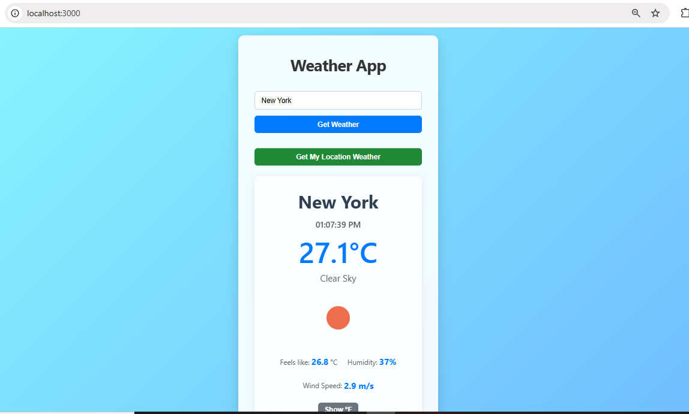
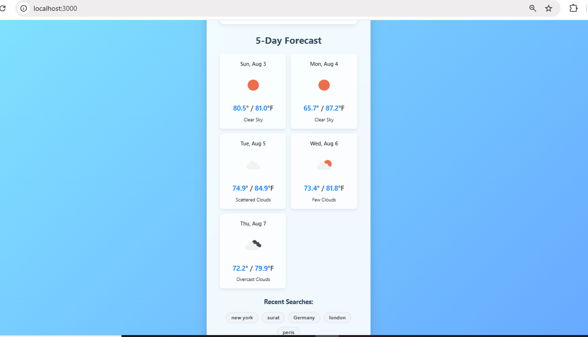

# 🌤️ Weather Forecast App

A dynamic and responsive web application that provides real-time weather updates and a 5-day forecast for any city or your current location.

---

## ✨ Features

- **Current Weather**: Get temperature, humidity, wind speed, and “feels like” temperature.
- **5-Day Forecast**: Displays daily highs, lows, and weather conditions.
- **Search by City**: Allows users to search weather data by entering a city name.
- **Auto-Location**: Uses your device's location to automatically fetch weather data.
- **Simple Caching**: Reduces redundant API calls using in-memory caching.
- **Responsive Design**: Works great on mobile, tablet, and desktop devices.

---

## 🛠️ Technologies Used

- **Node.js** – Backend runtime environment
- **Express.js** – Fast and minimalist web framework
- **EJS (Embedded JavaScript)** – Template engine for dynamic HTML rendering
- **Axios** – For API requests to OpenWeatherMap
- **OpenWeatherMap API** – Provides real-time weather and forecast data
- **Dotenv** – Securely manages API keys using environment variables

---

## 🚀 Getting Started

### ✅ Prerequisites

- Node.js and npm installed on your system

### 📥 Installation

1. **Clone the repository:**
   ```bash
   git clone https://github.com/nadiyadrakrishna/weather-forecast-app.git
   cd weather-forecast-app
Install dependencies:

```bash
npm install
```
Set up the API key:

Sign up at OpenWeatherMap to get a free API key.

Create a .env file in the project root and add:

```bash
WEATHER_API_KEY=your_api_key_here
```

Start the application:

```bash
npm start
```

Visit in browser:

```bash
http://localhost:3000
```
## 🖼️ Screenshots

### 🔸 Search Result – Current Weather


### 🔸 Auto-Location Weather Data


### 🔸 Search Result – 5-Day Forecast View



🤝 Contributing
Contributions are welcome! Here’s how you can help:

Fork the repo

Create your feature branch 
```bash
(git checkout -b feature/YourFeature)
```

Commit your changes
```bash
 (git commit -m 'Add your feature')
```

Push to the branch
```bash 
(git push origin feature/YourFeature)
```

Open a Pull Request


📧 Contact
For questions or suggestions, feel free to open an issue on GitHub.

Developed by [@nadiyadrakrishna](https://github.com/nadiyadrakrishna)
